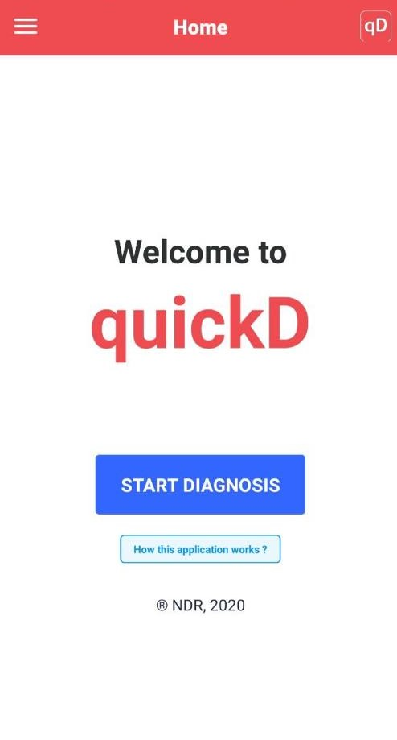
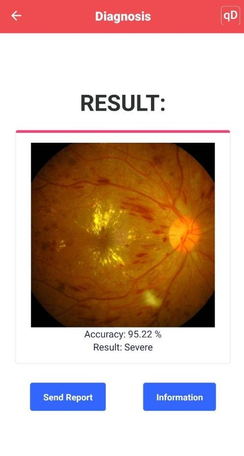

<!--
*** Thanks for checking out this README Template. If you have a suggestion that would
*** make this better, please fork the repo and create a pull request or simply open
*** an issue with the tag "enhancement".
*** Thanks again! Now go create something AMAZING! :D
***
***
***
*** To avoid retyping too much info. Do a search and replace for the following:
*** github_username, repo_name, twitter_handle, email
-->

<!-- PROJECT SHIELDS -->
<!--
*** I'm using markdown "reference style" links for readability.
*** Reference links are enclosed in brackets [ ] instead of parentheses ( ).
*** See the bottom of this document for the declaration of the reference variables
*** for contributors-url, forks-url, etc. This is an optional, concise syntax you may use.
*** https://www.markdownguide.org/basic-syntax/#reference-style-links
-->
[![Contributors][contributors-shield]][contributors-url]
[![Forks][forks-shield]][forks-url]
[![Stargazers][stars-shield]][stars-url]
[![Issues][issues-shield]][issues-url]-->
[![MIT License][license-shield]][license-url]
[![LinkedIn][linkedin-shield]][linkedin-url]

<!-- PROJECT LOGO -->
 

  

  <h3 align="center">quickD</h3>

  

    DETECTING DIABETIC RETINOPATHY USING COMPUTER VISION
     
    <a href="https://github.com/muhdlaziem/DR"><strong>Explore the docs »</strong></a>
     
     
    <a href="https://github.com/github_username/repo_name">View Demo</a>
    ·
    <a href="https://github.com/muhdlaziem/DR/issues">Report Bug</a>
    ·
    <a href="https://github.com/muhdlaziem/DR/issues">Request Feature</a>
  

<!-- TABLE OF CONTENTS -->
## Table of Contents

- [Table of Contents](#table-of-contents)
- [About The Project](#about-the-project)
  - [Built With](#built-with)
- [Getting Started](#getting-started)
  - [Installation](#installation)
- [Usage](#usage)
- [Contributing](#contributing)
- [License](#license)
- [Contact](#contact)
- [Acknowledgements](#acknowledgements)

<!-- ABOUT THE PROJECT -->
## About The Project

The diagnosis of DR currently using typical retinal fundus photography requires and depends on a skilled reader for the manual DR assessment opens to the inconsistency of the diagnosis. We aim to improve the diagnosis process for Diabetic Retinopathy patients using Computer Vision. Screening through mobile made queuing for doctor to do DR eye screening no more necessary. Moreover, our model give a result up to 97% accuracy.

### Built With

* [Python](https://www.python.org/)
* [Javascript](https://www.javascript.com/)
* [Flask](https://flask.palletsprojects.com/en/1.1.x/)
* [React Native](https://reactnative.dev/)
* [Google Cloud Platform](https://cloud.google.com/)

<!-- GETTING STARTED -->
## Getting Started

To use the app for diagnosis, please follow these simple steps.

### Installation

Install the mobile app by downloading the apk file in [apk\app-release.apk](https://raw.githubusercontent.com/muhdlaziem/DR/master/apk/app-release.apk)

<!-- USAGE EXAMPLES -->
## Usage

<!-- ROADMAP -->
<!-- ## Roadmap

See the [open issues](https://github.com/github_username/repo_name/issues) for a list of proposed features (and known issues). -->

<!-- CONTRIBUTING -->
## Contributing

Contributions are what make the open source community such an amazing place to be learn, inspire, and create. Any contributions you make are **greatly appreciated**.

<!-- LICENSE -->
## License

Distributed under the MIT License. See `LICENSE` for more information.

<!-- CONTACT -->
## Contact

* Muhammad Laziem - muhdlaziem@gmail.com
* Aishah Nabilah - ainachmrj@gmail.com
* Puteri Ameena - puteriameena.iium@gmail.com
* Muhammad Amiruddin - m.amiruddin27@gmail.com

Project Link: [https://github.com/muhdlaziem/DR](https://github.com/muhdlaziem/DR)

<!-- ACKNOWLEDGEMENTS -->
## Acknowledgements

* Assoc. Prof. Dr. Amelia Ritahani, Project Supervisor, Kuliyyah of Information Communication Technology IIUM Gombak Campus - amelia@iium.edu.my
* Mrs. Nurul Ain Binti Yahaya, Optometry Lecturer, Kuliyyah of Allied Health Science Kuantan IIUM Kuantan Campus - nurulainyahaya@iium.edu.my
* Mr. Selvah Karthikesu, Mentor, Roche - selvah.karthikesu@roche.com

<!-- MARKDOWN LINKS & IMAGES -->
<!-- https://www.markdownguide.org/basic-syntax/#reference-style-links -->
[contributors-shield]: https://img.shields.io/github/contributors/muhdlaziem/repo.svg?style=flat-square
[contributors-url]: https://github.com/muhdlaziem/DR/graphs/contributors
[forks-shield]: https://img.shields.io/github/forks/muhdlaziem/repo.svg?style=flat-square
[forks-url]: https://github.com/muhdlaziem/DR/network/members
[stars-shield]: https://img.shields.io/github/stars/muhdlaziem/repo.svg?style=flat-square
[stars-url]: https://github.com/muhdlaziem/automated-hazard-detection/stargazers
[issues-shield]: https://img.shields.io/github/issues/muhdlaziem/repo.svg?style=flat-square
[issues-url]: https://github.com/muhdlaziem/automated-hazard-detection/issues
[license-shield]: https://img.shields.io/github/license/muhdlaziem/repo.svg?style=flat-square
[license-url]: https://github.com/muhdlaziem/DR/blob/master/LICENSE
[linkedin-shield]: https://img.shields.io/badge/-LinkedIn-black.svg?style=flat-square&logo=linkedin&colorB=555
[linkedin-url]: https://www.linkedin.com/in/muhdlaziem/
[product-screenshot]: images/screenshot.png
